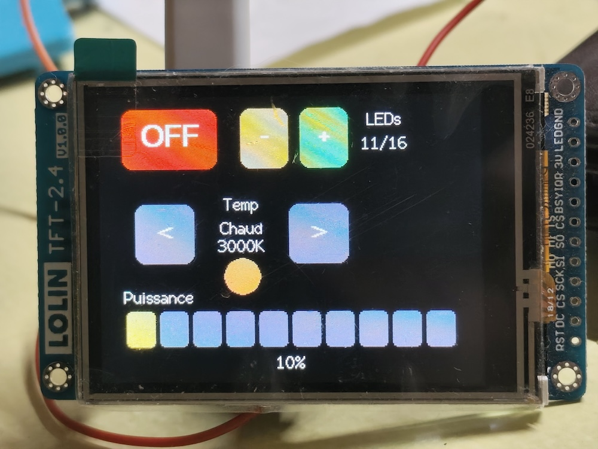
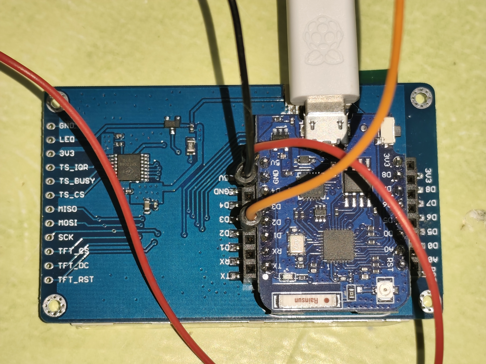
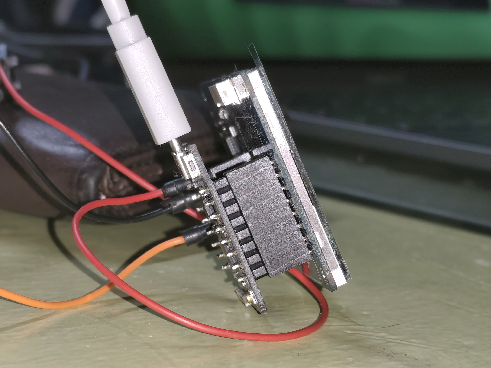

# ESP Light - Éclairage Photo (comme un) professionnel

Système d'éclairage LED contrôlable avec interface tactile pour photographie.





## 🎯 Caractéristiques

- **Contrôle tactile** : Interface graphique intuitive sur écran TFT 2.4" (240x320 pixels)
- **16 LEDs WS2812B** : Anneau RGB addressable avec contrôle individuel
- **Intensité variable** : De 1 à 16 LEDs allumées progressivement
- **Balance des blancs** : 3 températures de couleur (3000K / 5000K / 6500K)
- **Mode ON/OFF** : Activation/désactivation instantanée
- **Calibration tactile** : Mapping précis entre écran LCD et capteur tactile XPT2046

## 📦 Hardware

- **Microcontrôleur** : ESP8266 (Wemos D1 Mini) - 80MHz, 80KB RAM, 4MB Flash
- **Écran** : LOLIN TFT 2.4" Shield (ILI9341 240x320, 16-bit color)
- **Capteur tactile** : XPT2046 (résistif, nécessite calibration)
- **LEDs** : Anneau 16 LEDs WS2812B sur GPIO4 (D2)
- **Port série** : `/dev/tty.usbserial-0206A689` @ 115200 bauds

## 🎨 Interface

### Contrôles disponibles
- **ON/OFF** (rouge) : Allumer/éteindre toutes les LEDs
- **+** (vert) : Augmenter le nombre de LEDs actives (1-16)
- **-** (orange) : Diminuer le nombre de LEDs actives (1-16)
- **◀** (cyan) : Température précédente (Froid → Neutre → Chaud)
- **▶** (cyan) : Température suivante (Chaud → Neutre → Froid)

### Affichage en temps réel
- État du système : "LEDs ON" / "LEDs OFF"
- Nombre de LEDs actives : "X/16 LEDs"
- Température actuelle : "Chaud (3000K)" / "Neutre (5000K)" / "Froid (6500K)"
- Aperçu couleur : Cercle de prévisualisation en bas de l'écran

### Température de couleur
| Mode | Kelvin | Couleur | Usage |
|------|--------|---------|-------|
| **Chaud** | 3000K | Orange/Doré | Ambiance chaleureuse, lever/coucher de soleil |
| **Neutre** | 5000K | Blanc naturel | Lumière du jour, portraits naturels |
| **Froid** | 6500K | Bleuté | Studio photo, éclairage technique |

## 🎯 Calibration tactile

### Pourquoi calibrer ?
Le capteur tactile **XPT2046** utilise son propre système de coordonnées qui **ne correspond pas** directement aux coordonnées de l'écran LCD **ILI9341**. Les raisons :
- Rotation différente entre LCD et capteur tactile
- Offset/décalage des origines
- Résolution native différente
- Possible inversion d'axes (X/Y)

### Processus de calibration
1. Activer le mode debug : `debugTouch = true`
2. Compiler et uploader le firmware
3. Toucher les 4 coins de chaque bouton et noter les coordonnées affichées
4. Calculer la zone tactile : 
   - `touchX = min(X observés)`
   - `touchY = min(Y observés)`
   - `touchW = max(X) - min(X)`
   - `touchH = max(Y) - min(Y)`
5. Mettre à jour les structures `Button` avec les nouvelles coordonnées
6. Désactiver le mode debug : `debugTouch = false`

### Coordonnées actuelles (calibrées)
```cpp
// Position graphique (x, y, largeur, hauteur) vs tactile (touchX, touchY, touchW, touchH)
Button btnOnOff    = {20,  80, 80, 50,  226, 83,  73, 48, "ON/OFF", TFT_RED};
Button btnPlus     = {120, 80, 40, 50,  111, 84,  41, 49, "+",      TFT_GREEN};
Button btnMinus    = {170, 80, 40, 50,  164, 80,  38, 51, "-",      TFT_ORANGE};
Button btnTempLeft = {30,  160, 50, 50, 114, 170, 49, 41, "<",      TFT_CYAN};
Button btnTempRight= {160, 160, 50, 50, 243, 163, 46, 51, ">",      TFT_CYAN};
```

## 🚀 Installation

### 1. Environnement Python
```bash
python3 -m venv venv
source venv/bin/activate
pip install platformio esptool
```

### 2. Compilation et Upload
```bash
# Compiler
pio run

# Compiler et uploader
pio run -t upload

# Moniteur série
pio device monitor --baud 115200
```

## 📁 Structure du projet

```
selfie-light/
├── platformio.ini      # Configuration PlatformIO
├── src/
│   └── main.cpp       # Code source principal
├── include/
│   └── lv_conf.h      # Configuration LVGL (non utilisée)
├── lib/               # Bibliothèques locales
├── test/              # Tests unitaires
└── venv/              # Environnement Python
```

## 🔧 Configuration matérielle

### Broches TFT Shield
| Pin D1 Mini | GPIO | Fonction |
|-------------|------|----------|
| D0 | 16 | TFT_CS |
| D3 | 0 | TOUCH_CS |
| D5 | 14 | SCK |
| D6 | 12 | MISO |
| D7 | 13 | MOSI |
| D8 | 15 | TFT_DC |

### LEDs WS2812B
- **GPIO** : D2 (GPIO4)
- **Nombre** : 16 LEDs en anneau
- **Alimentation** : 5V (via D1 Mini ou externe)

## 📚 Bibliothèques utilisées

- `TFT_eSPI@2.5.43` : Driver d'écran ILI9341 optimisé pour ESP8266
- `FastLED@3.5.0` : Contrôle des LEDs WS2812B (version compatible GCC 4.8.2)

## ⚙️ Architecture technique

### Mémoire
- **RAM totale** : 80KB (utilisation ~34% = 28KB)
- **Flash** : 4MB (utilisation ~31% = 324KB)
- **Contrainte** : Pas de LVGL possible (trop gourmand en RAM)

### Communication
- **SPI** : Écran TFT (27MHz)
- **Tactile** : XPT2046 via TFT_eSPI
- **LEDs** : Protocol WS2812B (timing précis 800kHz)

### Structure du code
```cpp
// Structure pour préréglages de couleurs
struct ColorPreset {
    const char* name;
    int kelvin;
    uint8_t r, g, b;
};

// Structure pour boutons avec double mapping
struct Button {
    int16_t x, y, w, h;              // Coordonnées graphiques (LCD)
    int16_t touchX, touchY, touchW, touchH;  // Coordonnées tactiles (capteur)
    const char* label;
    uint16_t color;
};
```

## 💡 Utilisation

1. Connecter l'anneau de LEDs sur D2 (GPIO4)
2. Monter le shield TFT sur le D1 Mini
3. Alimenter via USB ou batterie
4. Utiliser l'interface tactile pour contrôler l'éclairage

## 🎬 Application Photo

Idéal pour :
- Selfies et portraits
- Vidéos YouTube/streaming
- Éclairage d'appoint macro
- Éclairage de studio mobile

## 📝 Développé avec

- **IDE** : Visual Studio Code + PlatformIO
- **Framework** : Arduino pour ESP8266
- **Langage** : C++

## 🎨 Couleurs TFT_eSPI disponibles

Couleurs prédéfinies de la bibliothèque TFT_eSPI (format RGB565) :

### Couleurs de base
- `TFT_BLACK` (0, 0, 0)
- `TFT_WHITE` (255, 255, 255)
- `TFT_RED` (255, 0, 0)
- `TFT_GREEN` (0, 255, 0)
- `TFT_BLUE` (0, 0, 255)
- `TFT_CYAN` (0, 255, 255)
- `TFT_MAGENTA` (255, 0, 255)
- `TFT_YELLOW` (255, 255, 0)

### Couleurs étendues
- `TFT_ORANGE` (255, 180, 0)
- `TFT_GREENYELLOW` (180, 255, 0)
- `TFT_PINK` (255, 192, 203)
- `TFT_BROWN` (150, 75, 0)
- `TFT_GOLD` (255, 215, 0)
- `TFT_SILVER` (192, 192, 192)
- `TFT_SKYBLUE` (135, 206, 235)
- `TFT_VIOLET` (180, 46, 226)
- `TFT_PURPLE` (128, 0, 128)
- `TFT_OLIVE` (128, 128, 0)
- `TFT_LIGHTGREY` (211, 211, 211)
- `TFT_DARKGREY` (128, 128, 128)

### Couleur personnalisée
Pour créer vos propres couleurs RGB :
```cpp
uint16_t customColor = tft.color565(r, g, b);  // r, g, b: 0-255
```

---

*Projet créé en janvier 2026*
